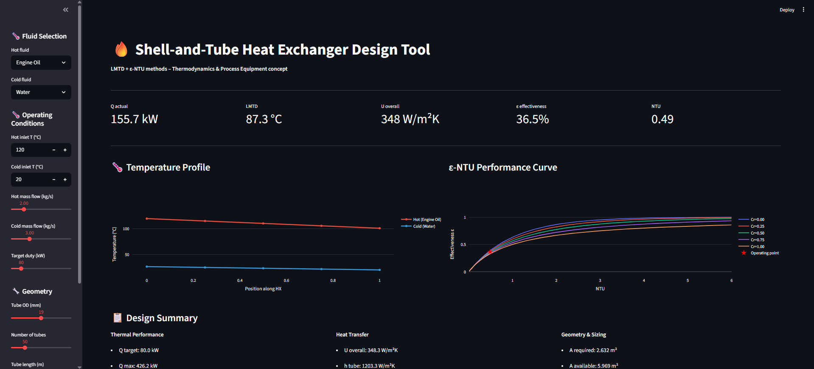

# Shell-and-Tube Heat Exchanger Design Tool
 

 
## Overview
Interactive heat exchanger design tool using LMTD and
epsilon-NTU methods. Sizes shell-and-tube exchangers for
5 common fluids with full thermal and hydraulic analysis.
 
## Live Demo
**[Open Tool](https://heat-exchanger-tool-wscc7r2kaml4fl22ocgxcu.streamlit.app/)**
 
## Features
- LMTD and epsilon-NTU calculation methods
- 5 fluids: Water, Engine Oil, Ethylene Glycol, Air, Steam
- Dittus-Boelter correlation for heat transfer coefficients
- Temperature profile visualization (counter/parallel flow)
- epsilon-NTU performance curves with operating point
- Pressure drop estimation (Darcy-Weisbach)
- Area adequacy check (required vs available)

 
## Author
**Oscar Vincent Dbritto**
# heat-exchanger-tool
